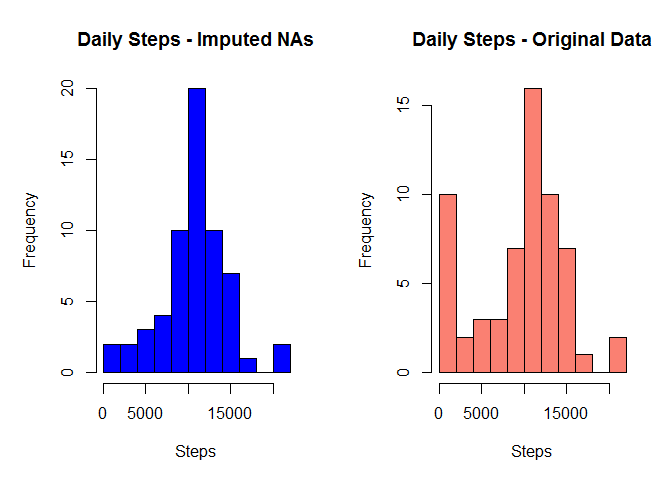

# Reproducible Research: Peer Assessment 1


## Loading and preprocessing the data

```r
suppressPackageStartupMessages(library(dplyr))
suppressPackageStartupMessages(library(ggplot2))
suppressPackageStartupMessages(library(mice))
suppressPackageStartupMessages(library(VIM, verbose=FALSE))
suppressPackageStartupMessages(library(lattice, verbose=FALSE))

df=read.csv(unz("activity.zip","activity.csv"),colClasses=c("integer","Date","numeric"),header=T)
```

## What is mean total number of steps taken per day?

```r
# Total daily steps
dailySteps=df %>% group_by(date) %>% summarize(totSteps=sum(steps,na.rm=T))
# Histogram
hist(dailySteps$totSteps, breaks=10, col="salmon", xlab="Steps", ylab="Frequency", main="Histogram of Daily Total Steps")
```

<!-- -->

```r
# Mean and median
summary(dailySteps$totSteps)
```

```
##    Min. 1st Qu.  Median    Mean 3rd Qu.    Max. 
##       0    6778   10400    9354   12810   21190
```

## What is the average daily activity pattern?

```r
# Average steps in each 5-minute interval across all days
intervalSteps=df %>% group_by(interval) %>% summarize(avgSteps=mean(steps,na.rm=T))
# Plot avg steps by interval
with(intervalSteps, plot(interval, avgSteps, type="l", col="blue",xlab="Interval",ylab="Average Steps"))
```

<!-- -->

```r
# Interval with max steps on avg
mVec=which(intervalSteps$avgSteps==max(intervalSteps$avgSteps))
maxInt=as.integer(intervalSteps[mVec,]$interval)
maxHrL=maxInt %/% 100
maxMinuteL=maxInt %% 100
maxHrH=ifelse(maxMinuteL == 55, maxHrL+1, maxHrL)
maxAvgSteps=as.integer(intervalSteps[mVec,]$avgSteps)
if (maxHrH > 23) maxHrH=0
maxMinuteH=ifelse(maxMinuteL == 55, 0, maxMinuteL+5)
cat(sprintf("Interval %d:%d to %d:%d has the highest average steps = %d\n", maxHrL, maxMinuteL, maxHrH, maxMinuteH, maxAvgSteps))
```

```
## Interval 8:35 to 8:40 has the highest average steps = 206
```

## Imputing missing values

```r
# What data is missing? It appears that only steps data are missing
md.pattern(df)
```

```
##       date interval steps     
## 15264    1        1     1    0
##  2304    1        1     0    1
##          0        0  2304 2304
```

```r
# Rows with missing steps
numNARows=nrow(df[is.na(df$steps),])
totRows=nrow(df)
cat(sprintf("Total rows in dataset = %d, NA rows = %d, Fraction of NA rows = %.4f\n", totRows, numNARows, numNARows/totRows))
```

```
## Total rows in dataset = 17568, NA rows = 2304, Fraction of NA rows = 0.1311
```

```r
# Try to understand if there is a pattern in missing steps data
marginplot(df[c(3, 1)], alpha=0.2)
```

<!-- -->

```r
cat("It appears that the distribution of the interval with missing steps is almost identical to that with non-missing steps. This suggests that missing data are randomly distributed.\n")
```

```
## It appears that the distribution of the interval with missing steps is almost identical to that with non-missing steps. This suggests that missing data are randomly distributed.
```

```r
cat("We use mice() to impute missing values.\n")
```

```
## We use mice() to impute missing values.
```

```r
# Impute missing steps data
tempDf=mice(data=df[c(1,3)], m=1, maxit=25, meth='pmm', seed=500, printFlag = FALSE)
completedDf=complete(tempDf, 1) 
completedDf$date=df$date

## Imputed results
# Total daily steps
impDailySteps=completedDf %>% group_by(date) %>% summarize(totSteps=sum(steps,na.rm=T))
# Histogram
par(mfrow=c(1,2), mar=c(5,5,4,2))
hist(impDailySteps$totSteps, breaks=10, col="blue", xlab="Steps", ylab="Frequency", main="Daily Steps - Imputed NAs")
hist(dailySteps$totSteps, breaks=10, col="salmon", xlab="Steps",  ylab="Frequency", main="Daily Steps - Original Data")
```

<!-- -->

```r
par(mfrow=c(1,1))
# Mean and median
cat("Imputed summary:\n")
```

```
## Imputed summary:
```

```r
summary(impDailySteps$totSteps)
```

```
##    Min. 1st Qu.  Median    Mean 3rd Qu.    Max. 
##      41    8821   10440   10570   12810   21190
```

```r
cat("Orig summary:\n")
```

```
## Orig summary:
```

```r
summary(dailySteps$totSteps)
```

```
##    Min. 1st Qu.  Median    Mean 3rd Qu.    Max. 
##       0    6778   10400    9354   12810   21190
```


## Are there differences in activity patterns between weekdays and weekends?

```r
# Create weekday/weekend flag
wkends=which(weekdays(completedDf$date, abbreviate = "TRUE") %in% c("Sat", "Sun"))
completedDf$wkdayFlag="weekday"
completedDf[wkends, "wkdayFlag"]="weekend"
completedDf$wkdayFlag=as.factor(completedDf$wkdayFlag)

intervalSteps2=completedDf %>% group_by(wkdayFlag, interval) %>% summarize(avgSteps=mean(steps))
# Plot avg steps by wkdayFlag, interval
with(intervalSteps2, xyplot(avgSteps ~ interval | wkdayFlag, type="l", col="blue", xlab="Interval", ylab="Average Steps", layout=c(1,2)))
```

<!-- -->
